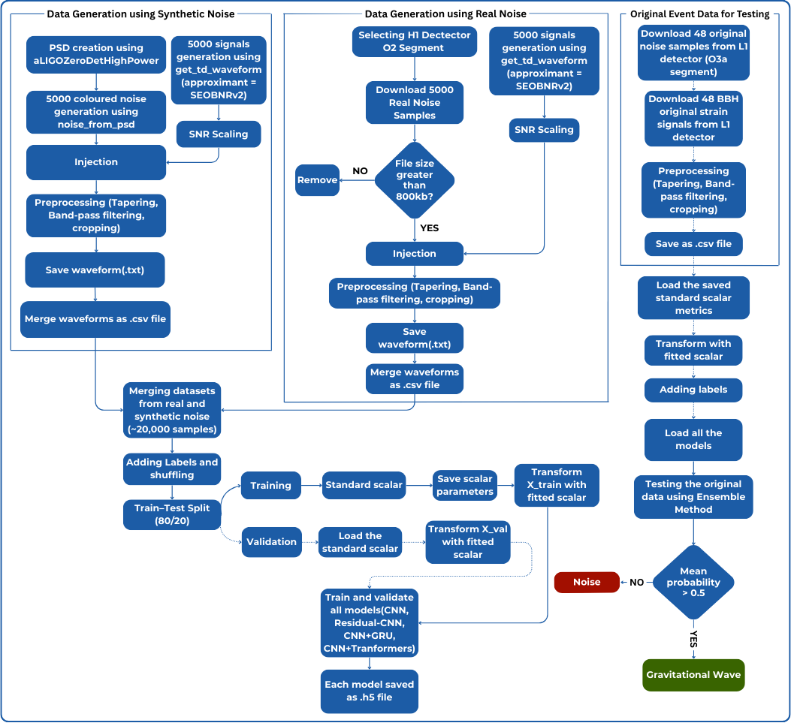

# 🌌 GravNet:Gravitational Wave Signal Detection using Deep Learning


## Project Description

This project presents a **deep learning based pipeline for detecting real gravitational wave signals** from binary black hole mergers in both synthetic and real LIGO noise. Using the SEOBNRv2 waveform model from PyCBC, we generated realistic datasets, applied advanced preprocessing techniques including tapering, bandpass filtering, cropping and SNR scaling, and trained multiple architectures such as Deep CNN, Residual CNN, CNN+GRU and CNN+Transformers to classify real signals from noise.

## Objectives

To develop and evaluate deep learning models for detecting real gravitational wave signals from noisy detector data using both simulated and real datasets.

## Dataset Information and Preprocessing

This project uses a combined dataset designed to improve generalization for gravitational wave detection. It consists of four main categories:  
&nbsp;&nbsp;&nbsp;&nbsp;• **Coloured synthetic noise** generated from the aLIGOZeroDetHighPower PSD.  
&nbsp;&nbsp;&nbsp;&nbsp;• **Synthetic signal-injected noise**, where SEOBNRv2 waveforms are injected into coloured synthetic noise.  
&nbsp;&nbsp;&nbsp;&nbsp;• **Real noise** segments from the LIGO Hanford (H1) detector.  
&nbsp;&nbsp;&nbsp;&nbsp;• **Real signal-injected noise**, where SEOBNRv2 waveforms are injected into real noise.  

🔭 **Signal Generation**  
&nbsp;&nbsp;&nbsp;&nbsp;• Signals are generated using the **SEOBNRv2** waveform model.  
&nbsp;&nbsp;&nbsp;&nbsp;• Component masses uniformly sampled between **10–50 M⊙**.  
&nbsp;&nbsp;&nbsp;&nbsp;• Spin parameters drawn from **−0.99 to 0.99**.  
&nbsp;&nbsp;&nbsp;&nbsp;• Inclination angles uniformly sampled between **0 and π**.  
&nbsp;&nbsp;&nbsp;&nbsp;• Each signal is scaled to a target **SNR between 8 and 12**.  

🛠 **Preprocessing Steps**  
&nbsp;&nbsp;&nbsp;&nbsp;1. **Tapering**: Tukey window (α = 0.5) to reduce edge artifacts.  
&nbsp;&nbsp;&nbsp;&nbsp;2. **Bandpass Filtering**: 35–350 Hz to match LIGO’s sensitive band.  
&nbsp;&nbsp;&nbsp;&nbsp;3. **Cropping**: Fixed 4-second segments at a 4096 Hz sample rate.  
&nbsp;&nbsp;&nbsp;&nbsp;4. **PSD Estimation**: Used for accurate SNR scaling.  
&nbsp;&nbsp;&nbsp;&nbsp;5. **Signal Injection**: Added at random times (1.0s, 1.5s, 2.0s, 2.5s, 3.0s).  
&nbsp;&nbsp;&nbsp;&nbsp;6. **Saving Format**: All noise-only, signal-only, and injected time series are merged into unified `.csv` files, enabling direct use for training and testing.  

This preprocessing ensures the dataset closely resembles real gravitational wave detection conditions while retaining full experimental control over parameters.  

## Project Structure




## Installation 

This project is fully containerized using **Docker**, ensuring consistent environments across systems.  

### **1. Clone the Repository**  
```bash
git clone https://github.com/ACM40960/project-gravnet-neural-gw-signal-detection.git
cd project-gravnet-neural-gw-signal-detection
```

### **2. Build the Docker Image** 
```bash
docker build -t gravnet-gw-detection .
```

### **3. Run the Container**
```bash
docker run -it --gpus all \
    -v $(pwd):/workspace \
    --name gravnet-container gravnet-gw-detection
```
•	--gpus all enables GPU acceleration for training.  
•	--name gravnet-container assigns a custom container name.  
Remove --gpus all if you are running on CPU only.


## ▶️ Running the Project (Synthetic + Real Data Combined)
## 🚀 Usage

Follow these steps in order:

1. **Generate Real Noise Data**  
   📄 [Real noise generation.ipynb](https://github.com/ACM40960/project-gravnet-neural-gw-signal-detection/blob/main/Scripts/Working%20With%20Synthetic%20And%20Real%20Data%20Combined/Real%20noise%20generation.ipynb)

2. **Generate Combined Dataset**  
   📄 [Combined dataset generation.ipynb](https://github.com/ACM40960/project-gravnet-neural-gw-signal-detection/blob/main/Scripts/Working%20With%20Synthetic%20And%20Real%20Data%20Combined/Combined%20dataset%20generation.ipynb)

3. **Train Models**
   - 🧠 [CNN.ipynb](https://github.com/ACM40960/project-gravnet-neural-gw-signal-detection/blob/main/Scripts/Working%20With%20Synthetic%20And%20Real%20Data%20Combined/CNN.ipynb) — Train Deep CNN  
   - 🧠 [CNN + GRU.ipynb](https://github.com/ACM40960/project-gravnet-neural-gw-signal-detection/blob/main/Scripts/Working%20With%20Synthetic%20And%20Real%20Data%20Combined/CNN%20%2B%20GRU.ipynb) — Train CNN + GRU  
   - 🧠 [Residual - CNN.ipynb](https://github.com/ACM40960/project-gravnet-neural-gw-signal-detection/blob/main/Scripts/Working%20With%20Synthetic%20And%20Real%20Data%20Combined/Residual%20-%20CNN.ipynb) — Train Residual CNN  
   - 🧠 [CNN + Transformers.ipynb](https://github.com/ACM40960/project-gravnet-neural-gw-signal-detection/blob/main/Scripts/Working%20With%20Synthetic%20And%20Real%20Data%20Combined/CNN%20%2B%20Transformers.ipynb) — Train CNN + Transformer  

4. **Download Original LIGO Data for Testing**  
   📄 [Downloading Original Data For Testing.ipynb](https://github.com/ACM40960/project-gravnet-neural-gw-signal-detection/blob/main/Scripts/Working%20With%20Synthetic%20And%20Real%20Data%20Combined/Downloading%20Original%20Data%20For%20Testing.ipynb)

5. **Final Model Testing**  
   📄 [Final Model Testing Using Original Data.ipynb](https://github.com/ACM40960/project-gravnet-neural-gw-signal-detection/blob/main/Scripts/Working%20With%20Synthetic%20And%20Real%20Data%20Combined/Final%20Model%20Testing%20Using%20Original%20Data.ipynb)

---

📌 **Note**:  
- All datasets will be saved in the `data/` directory (or your configured path).  
- Model weights will be stored in `models/`.   


## Results

add images

The table below summarizes the performance of all trained models on the **combined dataset** and their evaluation on **real gravitational wave events** and **real noise**.

| Model                  | Validation Accuracy | ROC AUC  | Real GW Events Accuracy | Real Noise Accuracy |
|------------------------|---------------------|----------|-------------------------|---------------------|
| Deep CNN               | 84.0%               | 0.9335    | 100%                   | 100%               |
| CNN + GRU              | 83.0%               | 0.9307    | 100%                   | 100%               |
| Residual CNN           | 88.9%               | 0.9587    | 83.33%                 | 100%               |
| CNN + Transformer      | 81.0%               | 0.9407    | 77.08%                 | 100%               |
|**Ensemble(All Models)**| **100%**            | **1.000**| **100%**                | **100%**            |


## Future Work


## Acknowledgements


## Contact

sundararajan.work@gmail.com   
swetasankaran.work@gmail.com