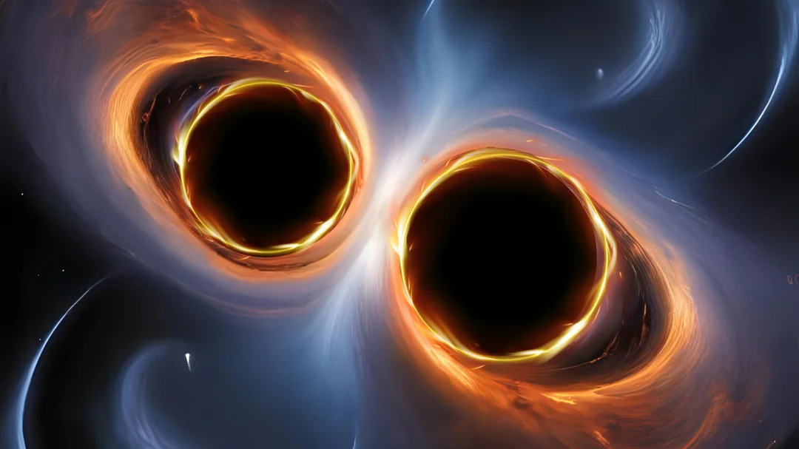
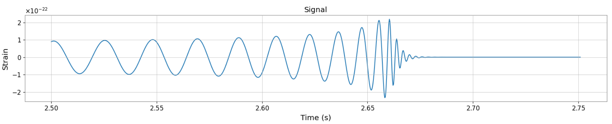
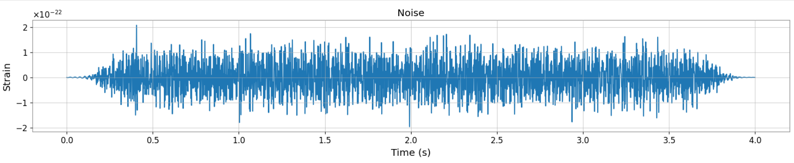
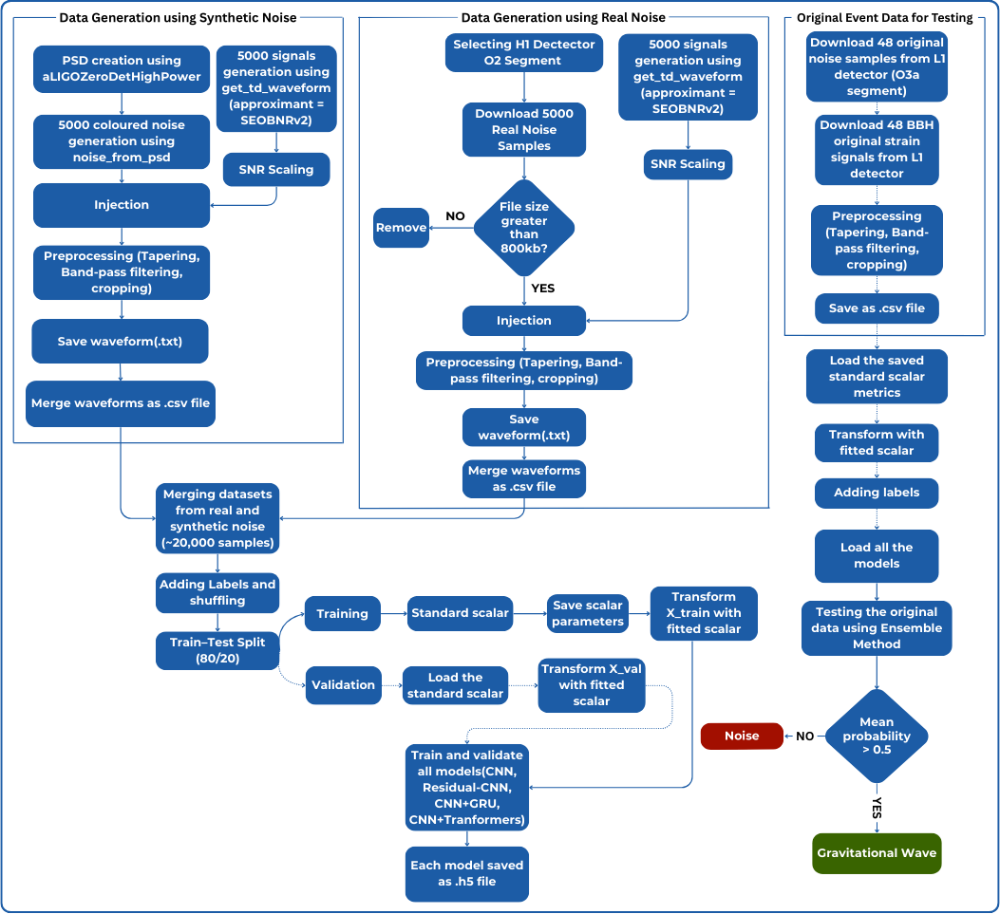

<p align="center">
  
</p>

<p align="center">
   
  <span style="font-size:28px; font-weight:bold;"> GravNet: Gravitational Wave Signal Detection using Deep Learning </span>
</p>
<p align="center">
  <b>Authors:</b> Sundararajan Srinivasan, Sweta Sankaran  
</p>


---

##  Project Description

This project presents a **deep learning–based pipeline for detecting gravitational wave signals** from binary black hole mergers in both **synthetic** and **real LIGO noise**.  
Using the **SEOBNRv2 waveform model** from PyCBC, we generated realistic datasets, applied advanced preprocessing techniques (tapering, bandpass filtering, cropping, SNR scaling), and trained multiple architectures such as **Deep CNN, Residual CNN, CNN+GRU, and CNN+Transformers** to classify real signals from noise.

---

##  Objectives

To develop and evaluate deep learning models for detecting real gravitational wave signals from noisy detector data using both simulated and real datasets.

---

##  Dataset & Preprocessing

This project uses a **combined dataset** of synthetic and real data designed to improve generalization for gravitational wave detection.  
It consists of four categories:

- **Synthetic Data**  
  • Coloured noise generated from the aLIGOZeroDetHighPower PSD  
  • Synthetic signal-injected noise (SEOBNRv2 waveforms injected into synthetic noise)  

- **Real Data**  
  • Noise segments from the LIGO Hanford (H1) detector  
  • Real signal-injected noise (SEOBNRv2 waveforms injected into real noise)  

  **Signal Generation**  
- Generated using **SEOBNRv2 waveform model**  
- Component masses: **10–50 M⊙** (uniform)  
- Spin parameters: **−0.99 to 0.99**  
- Inclination angles: **0 to π** (uniform)  
- Each signal scaled to **SNR = 8–12**  

---

###   Example Time-Domain Data  

Below are representative examples of the dataset:

<p align="center">
  
  <br/>
  <em>Figure 1: Clean BBH signal (zoomed-in view) before injection.</em>
</p>

<p align="center">
  
  <br/>
  <em>Figure 2: 4-second noise-only segment extracted from LIGO O2 data.</em>
</p>

<p align="center">
  
  <br/>
  <em>Figure 3: Example of a BBH signal (SEOBNRv2) injected into noise.</em>
</p>

 Dataset Access  

The combined dataset (synthetic + real noise with signal injections) is available for direct download:  

  [Download Dataset (Google Drive)](https://drive.google.com/drive/folders/1bpVCBiB1myWyYaMcS4tGKT_K1J62Sgas?usp=sharing)  

 The dataset file is large (approximately 28GB). Make sure you have stable internet and sufficient storage before downloading.

Includes noise-only, signal-only, and injected series in `.csv` format, along with preprocessed training and validation splits.  

For users who prefer to generate the dataset manually, detailed Jupyter notebooks are provided in the [Usage](#usage) section.  


##  Project Structure

Here’s the high-level workflow of the GravNet pipeline:  

<p align="center">
  
</p>

###   Pipeline Steps  

1. **Noise Selection**: Extract 4-second segments of O2 H1 strain data or generate synthetic noise at 4096 Hz.  
2. **Signal Generation & Injection**: Create BBH waveforms (SEOBNRv2) with component masses 5–50 M☉, spins −0.99 to 0.99, and inclination 0–π, then inject at random times into synthetic & real noise (SNR 8–12).  
3. **Preprocessing**: Apply Tukey taper and band-pass filter (35–350 Hz), then crop to final segment.  
4. **Dataset Split**: Create balanced training/validation sets (equal signal and noise samples).  
5. **Scaling**: Standardize train, validation, and test sets using statistics from train-only data.  
6. **Model Training**: Train CNN, Residual CNN, CNN+GRU, and Transformer models for signal vs. noise classification.  
7. **Evaluation**: Test on confirmed BBH events using ensemble prediction.  
8. **Classification**: Output as *Gravitational Wave* or *Noise*.  

---

##   Preprocessing Techniques (more detailed view) 

To ensure the dataset closely resembles real GW detection conditions, we have applied the following steps:  

1. **Tapering** – Tukey window (α = 0.5) to reduce spectral leakage and edge artifacts.  
2. **Bandpass Filtering** – Restrict frequency content to 35–350 Hz (LIGO’s most sensitive band).  
3. **Cropping** – Extract 4-second segments sampled at 4096 Hz.  
4. **PSD Estimation & SNR Scaling** – Scale signals to a target SNR of 8–12 using noise PSD.  
5. **Standardization** – Normalize train/val/test datasets using statistics from train-only data.  

---

##  Model Architectures

Click on any model name to view its **full architecture diagram**:  

####  [1. Deep CNN](https://github.com/ACM40960/project-gravnet-neural-gw-signal-detection/blob/main/Images/Model%20Architecture/CNN-1.png)

####  [2. Residual CNN](https://github.com/ACM40960/project-gravnet-neural-gw-signal-detection/blob/main/Images/Model%20Architecture/Residual%20CNN-1.png)

####  [3. CNN + GRU](https://github.com/ACM40960/project-gravnet-neural-gw-signal-detection/blob/main/Images/Model%20Architecture/CNN%20-%20GRU-1.png)

####  [4. CNN + Transformer](https://github.com/ACM40960/project-gravnet-neural-gw-signal-detection/blob/main/Images/Model%20Architecture/CNN%20-%20Transformers-1.png)

## Installation 

This project is fully containerized using **Docker**, ensuring consistent environments across systems.  

### **1. Clone the Repository**  
```bash
git clone https://github.com/ACM40960/project-gravnet-neural-gw-signal-detection.git
cd project-gravnet-neural-gw-signal-detection
```

### **2. Build the Docker Image** 
```bash
docker build -t gravnet-gw-detection .
```

### **3. Run the Container**
```bash
docker run -it --gpus all \
    -v $(pwd):/workspace \
    --name gravnet-container gravnet-gw-detection
```
•	--gpus all enables GPU acceleration for training.  
•	--name gravnet-container assigns a custom container name.  
Remove --gpus all if you are running on CPU only.


##  Running the Project (Synthetic + Real Data Combined)
##  Usage

Follow these steps in order:

1. **Generate Real Noise Data**  
-  [Real noise generation.py](https://github.com/ACM40960/project-gravnet-neural-gw-signal-detection/blob/main/Scripts/Working%20With%20Synthetic%20And%20Real%20Data%20Combined/Real%20Noise%20Download%20from%20H1%20detector%20O2%20run.py)<br>
   -  [Cleaning Real noise generation.py](https://github.com/ACM40960/project-gravnet-neural-gw-signal-detection/blob/main/Scripts/Working%20With%20Synthetic%20And%20Real%20Data%20Combined/Cleaning%20Real%20Noise%20From%20O2%20Run.py)
     
2. **Generate Combined Dataset**  
    [Combined dataset generation.ipynb](https://github.com/ACM40960/project-gravnet-neural-gw-signal-detection/blob/main/Scripts/Working%20With%20Synthetic%20And%20Real%20Data%20Combined/Combined%20dataset%20generation.ipynb)

3. **Train Models**
   -   [CNN.ipynb](https://github.com/ACM40960/project-gravnet-neural-gw-signal-detection/blob/main/Scripts/Working%20With%20Synthetic%20And%20Real%20Data%20Combined/CNN.ipynb) — Train Deep CNN  
   -   [CNN + GRU.ipynb](https://github.com/ACM40960/project-gravnet-neural-gw-signal-detection/blob/main/Scripts/Working%20With%20Synthetic%20And%20Real%20Data%20Combined/CNN%20%2B%20GRU.ipynb) — Train CNN + GRU  
   -   [Residual - CNN.ipynb](https://github.com/ACM40960/project-gravnet-neural-gw-signal-detection/blob/main/Scripts/Working%20With%20Synthetic%20And%20Real%20Data%20Combined/Residual%20-%20CNN.ipynb) — Train Residual CNN  
   -  [CNN + Transformers.ipynb](https://github.com/ACM40960/project-gravnet-neural-gw-signal-detection/blob/main/Scripts/Working%20With%20Synthetic%20And%20Real%20Data%20Combined/CNN%20%2B%20Transformers.ipynb) — Train CNN + Transformer  

4. **Download Original LIGO Data for Testing**  
    [Downloading Original Data For Testing.ipynb](https://github.com/ACM40960/project-gravnet-neural-gw-signal-detection/blob/main/Scripts/Working%20With%20Synthetic%20And%20Real%20Data%20Combined/Downloading%20Original%20Data%20For%20Testing.ipynb)

5. **Final Model Testing**  
    [Final Model Testing Using Original Data.ipynb](https://github.com/ACM40960/project-gravnet-neural-gw-signal-detection/blob/main/Scripts/Working%20With%20Synthetic%20And%20Real%20Data%20Combined/Final%20Model%20Testing%20Using%20Original%20Data.ipynb)

---

** Note:**  
- All datasets will be saved in the `data/` directory (or your configured path). 
- Model weights will be stored in `models/`.   


##  Results

The table below summarizes the performance of all trained models on the **combined dataset** and their evaluation on **real gravitational wave events** and **real noise**.

## Real Data Testing Results  

| Model                | Accuracy   | Sensitivity (Recall) | Precision | F1 Score |
|-----------------------|------------|-----------------------|-----------|----------|
| Residual CNN          | 91.67%     | 83.33%                | 100.00%   | 90.91%   |
| CNN + GRU             | 100.00%    | 100.00%               | 100.00%   | 100.00%  |
| Pure CNN              | 100.00%    | 100.00%               | 100.00%   | 100.00%  |
| CNN + Transformer     | 88.54%     | 77.08%                | 100.00%   | 87.06%   |
| **Ensemble (Avg of 4)** | 100.00%    | 100.00%               | 100.00%   | 100.00%  |

 **Detailed Results Notebooks**  

For a detailed information on each model's training results, click on the respective model below.

-   [Deep CNN Training Results](Scripts/Working%20With%20Synthetic%20And%20Real%20Data%20Combined/CNN.ipynb)  
-   [Residual CNN Training Results](Scripts/Working%20With%20Synthetic%20And%20Real%20Data%20Combined/Residual%20-%20CNN.ipynb)  
-   [CNN + GRU Training Results](Scripts/Working%20With%20Synthetic%20And%20Real%20Data%20Combined/CNN%20%2B%20GRU.ipynb)  
-  [CNN + Transformer Training Results](Scripts/Working%20With%20Synthetic%20And%20Real%20Data%20Combined/CNN%20%2B%20Transformers.ipynb)  

Each notebook includes **training curves, validation metrics, and performance analysis**.  


##  Future Work

1. Extend to BNS, NS–BH, eccentric mergers, and lower SNR.
2. Multi-detector fusion (H1, L1, V1) for robust detection.
3. Real-time, low-latency deployment.
4. Add explainability tools (e.g., saliency maps).
5. Glitch classification module for noise rejection.


##  References  

1. Gabbard, A., Williams, M., Hayes, F., and Messenger, C. (2018). *Matching Matched Filtering with Deep Networks for Gravitational-Wave Astronomy*. **Physical Review Letters**, 120(14), 141103.  

2. George, D., and Huerta, E.A. (2018). *Deep Learning for Real-time Gravitational Wave Detection and Parameter Estimation: Results with Advanced LIGO Data*. **Physics Letters B**, 778, 64–70.  

3. Krastev, P.G. (2020). *Real-time Detection of Gravitational Waves from Binary Neutron Stars Using Artificial Neural Networks*. **Physics Letters B**, 803, 135330.  


##  Acknowledgements

This project was made possible with the help of the following:  

- **Professor Sarp Akcay, University College Dublin** — for invaluable guidance and supervision throughout the course project.  
- **LIGO Open Science Center (LOSC)** — for providing real gravitational wave strain data.  
- **PyCBC Toolkit & GWpy** — essential for waveform generation, signal injection, preprocessing, and visualization.  

##  Contact

sundararajan.work@gmail.com   
swetasankaran.work@gmail.com
